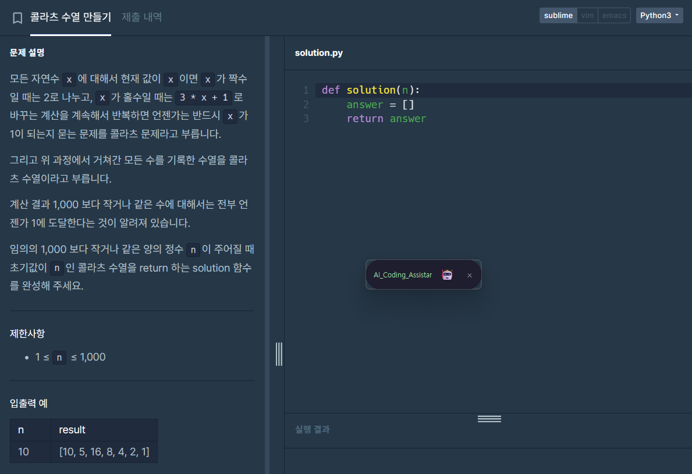
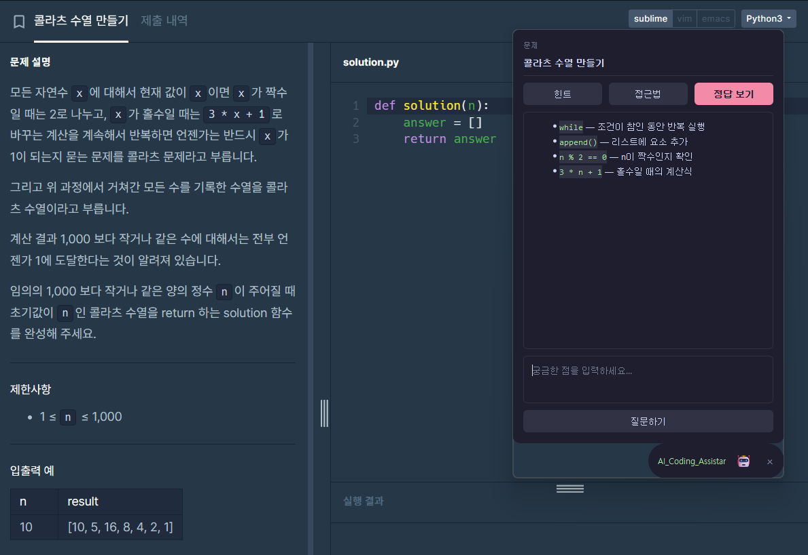
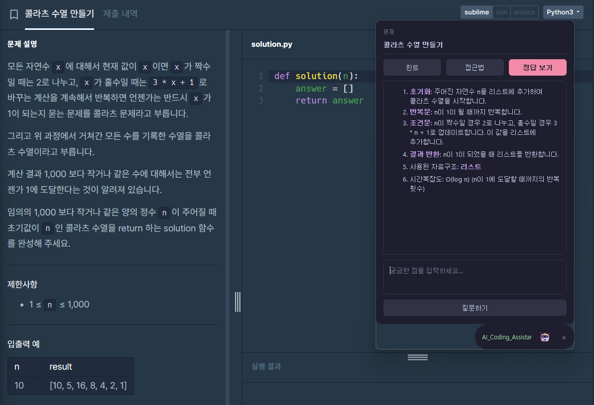
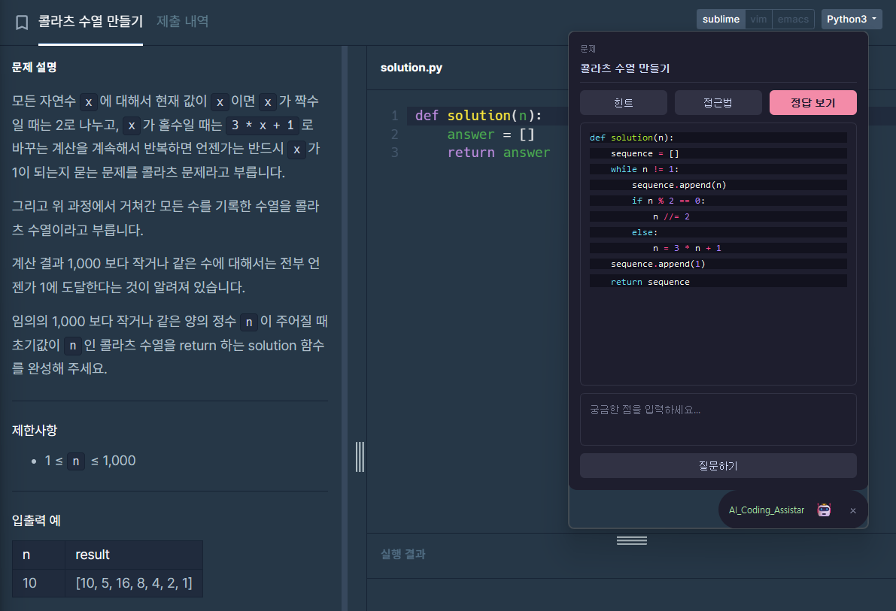

# AI Coding Test Assistant

> 코딩 테스트 풀이 중, 화면 우측에 떠있는 플로팅 위젯에서 힌트·접근법·정답 코드를 받을 수 있는 데스크톱 어시스턴트.

## 🎬 데모

[](https://youtu.be/qTPpKzS6hcg)

| 접힌 상태 | 힌트 |
|:---:|:---:|
|  |  |

| 접근법 | 정답 |
|:---:|:---:|
|  |  |

## ✨ 주요 기능

- 프로그래머스 문제 페이지 자동 인식 (URL 추적 + Playwright HTML 파싱)
- 3단계 도움 흐름: 키워드 힌트 → 단계별 접근법 → Python 정답 코드
- 자유 질문 입력으로 모르는 부분 추가 설명 요청
- LLM 응답 실시간 스트리밍 (SSE)
- 같은 문제 재요청 시 캐시 히트로 즉시 응답
- 문제 변경 자동 감지 → UI 제목 실시간 동기화
- 드래그 가능한 플로팅 위젯 (항상 위, 어디서든 호출)
- GPT-4o-mini ↔ 자체 파인튜닝 모델(Qwen2.5-Coder-7B) Provider 토글

## 🛠️ 기술 스택

`Python` `FastAPI` `PyQt6` `Playwright` `OpenAI GPT-4o-mini` `Qwen2.5-Coder-7B (자체 파인튜닝)` `pywinauto` `Pygments` `SSE` `asyncio`

---

## 🔍 시행착오와 의사결정

이 프로젝트는 처음 설계대로 한 번에 끝낸 게 아니라, 여러 번 갈아엎으면서 발전했다.
초기 가설을 검증하면서 더 나은 방식을 찾아간 과정을 기록한다.

### 1. 문제 인식 방식: Vision LLM → URL 기반 HTML 파싱

**초기 설계: 화면 캡처 + Vision LLM**

`mss`로 화면 좌측 절반을 주기적으로 캡처하고, `imagehash`(perceptual hash)로 변경 감지 후 Vision API로 문제 텍스트를 추출하는 방식이었다. 선택 이유:

- 멀티모달 LLM 실전 활용 사례
- 사이트 무관하게 동작 (백준, 리트코드 등 확장 용이)
- 화면 변경 감지 + 사전 분석 캐싱 같은 시스템 설계 요소

**실제 운영 후 발견된 한계**

- 페이지 로딩 중 캡처되면 빈 화면이나 스켈레톤만 인식 → `"문제 제목"` 같은 placeholder 응답
- 문제가 길어 한 화면에 안 들어오면 잘림
- Vision API 호출 비용 누적
- 무료 티어 RPM 제약(Gemini Flash 분당 15회)에 빈번하게 걸림

**대안 탐색: URL → HTML 파싱**

화면을 보는 대신, 활성 브라우저 탭의 URL을 직접 읽어 그 URL의 HTML을 파싱하는 쪽으로 방향을 틀었다.
이 과정에서도 두 번의 추가 시행착오가 있었다.

#### 1-1. URL 읽기 방식: `pyperclip` → `pywinauto`

| 방식 | 동작 | 결과 |
|---|---|---|
| `pyperclip` | Ctrl+L → Ctrl+C 시뮬레이션으로 클립보드에 URL 복사 | ❌ 사용자가 코딩 중 복사·붙여넣기 작업 시 클립보드 충돌 |
| `pywinauto` (UIA) | 크롬 주소창 컨트롤을 직접 읽음 | ✅ 클립보드 무관, 백그라운드 탭도 읽기 가능 |

`pywinauto`로 모든 크롬 창을 순회하며 `programmers.co.kr` 포함된 주소창을 찾는다.

#### 1-2. HTML 파싱: `httpx + BeautifulSoup` → `Playwright`

| 방식 | 결과 |
|---|---|
| `httpx + BeautifulSoup` | ❌ 프로그래머스가 SPA라 빈 껍데기 HTML만 응답 |
| 프로그래머스 내부 API 추정 호출 | ❌ `/api/v2/...` 류 경로 모두 404 |
| **`Playwright` (Headless Chromium)** | ✅ JS 렌더링 후 DOM 파싱으로 안정 추출 |

`li.active` 셀렉터에서 제목, `div.lesson-content div.markdown` 섹션 순회로 본문·제한사항·예제 표를 분리 추출한다.

**최종 결과**

- Vision LLM 호출 0회 → 비용 절감
- 문제 길이 무관하게 전문 추출
- DOM 직접 파싱이라 인식 오류 없음

---

### 2. LLM Provider: Gemini 무료 → OpenAI

**초기 선택: Gemini 2.5 Flash 무료 티어**

| 항목 | 값 |
|---|---|
| 일일 한도 (RPD) | 1,500 |
| Vision 지원 | ✅ (당시 Vision 추출 방식 사용 중) |
| 비용 | $0 |

**문제: 분당 한도(RPM)가 15회로 낮음**

개발·테스트 중 자주 429 에러가 발생했고, 한 번 걸리면 1~5분 대기 → 디버깅 사이클이 매우 느려졌다.

**해결: Provider 추상화 + OpenAI 전환**

처음부터 `BaseLLMClient` 추상 클래스를 두고 Provider별 구현을 분리해둔 덕에 전환 비용이 0에 가까웠다.
`.env`의 `LLM_PROVIDER=gemini` → `openai` 한 줄 변경만으로 전환된다.

```python
if LLM_PROVIDER == "openai":
    from .llm.openai_client import OpenAIClient
    llm = OpenAIClient()
elif LLM_PROVIDER == "local":
    from .llm.local_client import LocalClient
    llm = LocalClient()
else:
    from .llm.gemini_client import GeminiClient
    llm = GeminiClient()
```

GPT-4o-mini로 전환 후 RPM 제약 없이 작업 가능해졌다.
Gemini 클라이언트도 그대로 남겨둬서 환경변수만 바꾸면 즉시 복귀할 수 있다.

---

### 3. 단계별 도움 흐름 설계

힌트 → 접근법 → 정답을 분리한 건 사용자가 정답을 보기 전에 스스로 풀어보도록 유도하기 위함이다.
각 단계 프롬프트를 다르게 가드했다.

| 단계 | 가드 |
|---|---|
| **힌트** | 알고리즘·자료구조 이름 직접 언급 금지. 키워드와 짧은 표현식만 (예: `n % 2 == 0`) |
| **접근법** | 알고리즘·자료구조 명시, 단계별 흐름, 시간복잡도까지. 코드는 작성 금지 |
| **정답** | 코드블록·주석 없이 함수만. 들여쓰기 4칸 |

단계별로 정보 노출 수준을 다르게 만들어, 정답을 보기 전에 사고 과정을 거치도록 했다.

---

### 4. 응답 캐싱

같은 문제에서 힌트·접근법·정답을 여러 번 요청하는 건 흔한 패턴이다.
매번 LLM을 호출하면 비용·지연 낭비라 `response_cache` 딕셔너리에 결과를 저장하고 캐시 히트 시 즉시 반환한다.
문제가 바뀌면(`on_problem_change`) 캐시를 자동 초기화한다.

UI에서도 이를 반영해 **캐시 히트는 일반 POST(3초 타임아웃), 미스는 SSE 스트리밍**으로 fallback하는 구조다.
첫 요청은 한 글자씩 흘러나오고, 두 번째 요청부터는 즉시 표시된다.

2026/05/11 +
이후 추가 개선으로 문제가 감지되는 순간 hint·approach·solution 세 개를 `asyncio.gather`로 동시에 백그라운드 생성해두는 프리패치 구조를 도입했다.
사용자가 패널을 열고 버튼을 누를 때쯔엔 이미 캐시가 완성돼 있어, 처음 요청임에도 즉시 응답이 나온다.

스트리밍 엔드포인트(`/hint/stream` 등)에도 캐시를 적용해 캐시 히트 시 스트리밍 없이 단일 청크로 즉시 반환한다.

---

### 5. UI 렌더링: 스트리밍 ↔ 마크다운의 결합

LLM 응답을 한 글자씩 보여주면 체감 속도가 좋지만, 마크다운 렌더링은 완성된 텍스트가 있어야 한다.
이 둘을 자연스럽게 결합하는 게 까다로웠다.

| 시도 | 결과 |
|---|---|
| 매 청크마다 마크다운 렌더링 | ❌ 깜빡임 심함 |
| 스트리밍 중 plain text → 완료 시 마크다운 전환 | ❌ 잠깐 두 모습이 동시에 보이는 어색한 전환 |
| **로딩 중 "생각 중..." 표시 → 완료 시 마크다운 한 번에** | ✅ 자연스러움 |

스트리밍 자체는 백엔드에서 유지하되, UI에서는 buffer에만 쌓다가 완료 시점에 렌더링한다.
사용자 입장에서는 "생각 중 → 완성된 답변" 흐름이 자연스럽다.

2026/05/11 +
코드 부분은 Pygments(Monokai)로 하이라이팅한다.
정답 코드는 프롬프트에서 코드블록 없이 반환하라고 명시했고, 받은 텍스트를 직접 `PythonLexer`에 통과시킨다.

초기 구현에서는 버튼 클릭 시 non-streaming POST를 3초 타임아웃으로 먼저 시도하고, 실패하면 SSE 스트리밍으로 fallback하는 구조였다.
결과적으로 매 요청마다 3초를 낭비한 뒤 스트리밍이 시작됐다.

캐시 히트 여부를 서버에서 판단할 수 있으므로, 클라이언트는 항상 스트리밍 엔드포인트만 호출하는 방식으로 단순화했다.
캐시 히트면 서버가 즉시 단일 청크로 응답하고, 미스면 LLM 응답을 그대로 스트리밍한다.

---

### 6. 도입 검토 후 보류한 것: RAG

알고리즘 패턴 DB(`ChromaDB`)를 구축해 문제 입력 시 유사 패턴을 검색해 LLM 프롬프트에 컨텍스트로 주입하는 RAG 구조를 검토했다.

**보류 이유**: GPT-4o-mini가 코딩 테스트 수준 알고리즘 패턴(투 포인터, BFS/DFS, DP, 그리디 등)을 이미 충분히 알고 있어,
RAG 컨텍스트 주입의 marginal한 품질 개선보다 시스템 복잡도 증가가 더 컸다.
고난도 백준 문제 같은 곳에서 실효성 검증 후 도입할 예정이다.

기능 도입 자체보다 **"필요할 때 도입한다"는 판단**이 더 중요하다고 봤다.

---

### 7. LLM Provider 확장: 자체 파인튜닝 모델 연동

GPT-4o-mini 외에 직접 파인튜닝한 모델([coder-llm-finetune](https://github.com/HyeonBin0118/coder-llm-finetune))도 같은 인터페이스로 선택할 수 있도록 확장했다.
`BaseLLMClient` 추상화를 처음부터 잘 잡아둔 덕에, 이번에도 `.env`의 `LLM_PROVIDER` 한 줄만 바꾸면 전환된다.

**초기 계획: vLLM 서버**

로컬 모델을 OpenAI 호환 API로 서빙하려면 vLLM이 표준적인 선택이다. LoRA 어댑터를 베이스 모델에 merge한 뒤, AWQ로 4bit 양자화해서 vLLM에 올리는 계획을 세웠다.

**한계: vLLM/AutoAWQ는 Windows를 정식 지원하지 않음**

`autoawq` 설치 단계에서 빌드 의존성 문제로 막혔고, 이후 단계(vLLM의 CUDA 커널 컴파일)에서도 같은 종류의 문제가 반복될 게 명확했다. vLLM 생태계 자체가 Linux/WSL2 기준으로 만들어져 있어, Windows 네이티브 환경에서는 의존성 컴파일이 근본적으로 불안정하다.

**해결: OpenAI 호환 레이어를 직접 구현**

vLLM 없이, FastAPI로 `/v1/chat/completions` 엔드포인트 하나만 직접 흉내 내는 경량 서버([`serve_v5.py`](https://github.com/HyeonBin0118/coder-llm-finetune/blob/main/serve_v5.py))를 만들었다. 모델 로딩은 학습·평가 단계에서 이미 검증된 `transformers + bitsandbytes` 4bit 방식을 그대로 재사용해, 추가 컴파일 의존성이 전혀 없다.

```python
class LocalClient(BaseLLMClient):
    """coder-llm-finetune에서 파인튜닝한 모델을 자체 구현한
    OpenAI 호환 서버(serve_v5.py)로 호출하는 클라이언트."""
    # OpenAIClient와 동일한 프롬프트를 그대로 재사용, base_url만 로컬 서버로 교체
```

`AsyncOpenAI(base_url=...)`는 엔드포인트가 OpenAI 형식만 지키면 어떤 서버든 호출할 수 있어서, vLLM이든 직접 만든 서버든 `LocalClient` 코드는 한 글자도 바뀌지 않는다.

**현재 한계와 기본값 정책**

자체 평가([coder-llm-finetune 실험 기록](https://github.com/HyeonBin0118/coder-llm-finetune) 참고) 결과, 파인튜닝 모델의 코드 정답률은 약 43~57% 수준으로 GPT-4o-mini보다 낮다. 이 때문에 **기본 Provider는 `openai`로 유지**하고, `local`은 무료/오프라인 동작과 "Provider 전환 가능"한 구조를 보여주는 옵션으로 남겨뒀다.

---

## 🏗️ 아키텍처

```
[Browser]                       [FastAPI Backend]               [PyQt6 UI]
프로그래머스                ┌──────────────────────┐          ┌──────────┐
  문제 페이지               │ change_detector      │          │ 플로팅   │
       ↑                    │  (제목 폴링 0.5s)    │ ←폴링──  │ 위젯     │
       │                    │       ↓              │          │          │
       │ pywinauto          │ problem_fetcher      │ ←요청──  │          │
       │  (URL 추출)        │  (URL → HTML 파싱)   │  /hint   │          │
       │                    │       ↓              │  /approach          │
       │ Playwright         │ Provider 추상화      │  /solution          │
       └─(HTML 파싱)────────┤  ↓                   │  /ask    │          │
                            │ OpenAIClient /       │ ←스트리밍 └──────────┘
                            │ LocalClient          │
                            └──────────────────────┘
```

`change_detector`가 0.5초마다 활성 창 제목을 폴링해 프로그래머스 탭 변경을 감지한다.
변경 시 `problem_fetcher`가 크롬 주소창에서 URL을 읽고 Playwright로 문제 전문을 추출해 `problem_cache`에 저장한다.
UI는 2초마다 `/status`를 폴링해 제목을 동기화하고, 사용자가 버튼을 누르면 캐시된 문제 정보를 사용해 LLM에 요청한다.
`LLM_PROVIDER` 환경변수에 따라 `OpenAIClient`, `GeminiClient`, `LocalClient` 중 하나가 선택되며, 셋 모두 같은 `BaseLLMClient` 인터페이스를 구현한다.

2026/05/11 +
문제가 감지되는 즉시 `/prefetch`를 호출해 hint·approach·solution을 병렬로 미리 생성한다.
사용자가 버튼을 누르기 전에 캐시가 준비되므로 첫 요청도 즉시 응답된다.

---

## 🚀 실행

```bash
# 1. 가상환경
conda create -n coding_assistant_env python=3.11 -y
conda activate coding_assistant_env

# 2. 의존성
pip install -r requirements.txt
playwright install chromium

# 3. 환경 변수
cp .env.example .env
# OPENAI_API_KEY 입력 (또는 GEMINI_API_KEY + LLM_PROVIDER=gemini)
# 자체 파인튜닝 모델을 쓰려면 LLM_PROVIDER=local + coder-llm-finetune의 serve_v5.py 실행 필요

# 4. 실행 (터미널 두 개, local Provider 사용 시 세 개)
uvicorn backend.main:app --reload      # 백엔드
python ui/floating_widget.py            # UI
# python serve_v5.py  (coder-llm-finetune 레포에서, LLM_PROVIDER=local일 때만)
```

프로그래머스 문제 페이지를 크롬에서 연 상태로 위젯의 `[힌트]` `[접근법]` `[정답 보기]` 중 원하는 버튼을 누르면 된다.

---

## 🔮 향후 작업

- **인스톨러 배포**: PyInstaller + Inno Setup으로 더블클릭 실행 가능한 패키징.
  현재는 conda 환경 + 두 터미널 명령으로 실행해야 한다. Playwright Chromium 바이너리(~200MB) 번들링 처리가 필요해 별도 작업 예정.
- **다른 사이트 지원**: 백준, 리트코드. Playwright 셀렉터만 추가하면 가능한 구조.
- **RAG 도입 재검토**: 더 까다로운 문제군에서 효과를 검증한 후 결정.
- **로컬 모델 정답률 개선**: coder-llm-finetune 쪽에서 추가 실험으로 코드 정답률을 끌어올리면, `local`을 기본 Provider로 전환 검토.

---

## 📁 프로젝트 구조

```
ai-coding-test-assistant/
├── backend/
│   ├── main.py                  # FastAPI 진입점, 라우트
│   ├── config.py                # 환경변수
│   ├── schemas/models.py        # Pydantic 모델
│   └── llm/
│       ├── base.py              # Provider 추상 클래스
│       ├── openai_client.py     # GPT-4o-mini 구현
│       ├── gemini_client.py     # Gemini 2.5 Flash 구현
│       └── local_client.py      # 자체 파인튜닝 모델(coder-llm-finetune) 구현
├── screen_capture/
│   ├── problem_fetcher.py       # URL 추출 + Playwright HTML 파싱
│   └── change_detector.py       # 활성 탭 제목 폴링
├── ui/
│   └── floating_widget.py       # PyQt6 플로팅 위젯
├── images/                      # 데모 스크린샷
├── poc/                         # Phase 0 PoC 흔적 (Vision LLM)
├── .env.example
└── requirements.txt
```